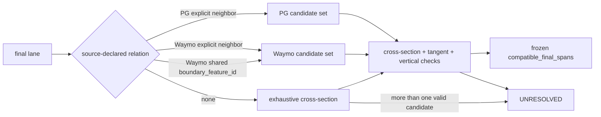

# Driving Mission v1.1 Data Audit — Findings

## Metadata

- Audit ID: `DRIVING-MISSION-V1.1-DATA-2026-08-03`
- Date: 2026-08-03
- Branch: `codex/route-coordinate-mission`
- Frozen selection hash: `f5651c89183a216c78ffa434618f98ed33c861fd79a324bf1ce71be58568f7b1`
- Records: 3,500 (1,695 PG; 1,805 Waymo)
- Source root inspected read-only: `/scratch/e.respino/thesis-metadrive/data/scenarionet`
- Production code changed: NO
- Source artifacts changed: NO

## Commands and evidence

The repository audit `thesis_rl.cli.scenarios.audit_driving_missions` was run
against the frozen index and the real source pickle tree. The host environment
lacked `pyarrow`; the audit path was loaded directly while isolating only the
unused ScenarioNet catalog import. No dependency was installed. The audit
returned `PASS`, 3,500/3,500, for its existing v1 checks: source file,
description/horizon, non-empty assigned route, lane presence, `exit_lanes`
connectivity, terminal valid pose, terminal route projection, vertical
compatibility, and neighbor references.

The v1.1 targeted read-only scan then checked reset occurrence, final
occurrence, terminal station, and preliminary concatenated-route simplicity.
The scan found no non-adjacent planar self-intersections. It is a preflight
diagnostic, not a substitute for implementation tests or the final-envelope
validator.

## Results

| Check | Result |
|---|---:|
| v1 audit pass | 3,500 / 3,500 |
| Reset pose in first occurrence | 3,487 |
| Reset invariant failures | 13, all Waymo |
| Terminal pose in final occurrence | 3,475 |
| Terminal outside final occurrence | 25, all Waymo |
| Positive terminal station | 3,499 |
| Non-positive terminal station | 1, PG |
| Preliminary non-adjacent planar intersections | 0 |
| v1 final `compatible_spans` cardinality | 1 for all 3,500 |
| Final lanes without explicit neighbor metadata | 488 (89 PG, 399 Waymo) |
| Preliminary neighbor cross-section candidates | 2,965 records |

The 2,965 candidates are not accepted compatible final spans. They were found
by a diagnostic cross-section/neighbor scan and do not prove corridor identity,
legal equivalence, service-road exclusion, or source-declared envelope
provenance.

## Interpretation

The v1.0 materialized `driving_mission` record is insufficient for v1.1 final
success. `final_goal.compatible_spans` is preferred-final-lane data, not a
frozen final lateral road envelope. `sections[*].allowed_spans` are section
routing data and cannot be reinterpreted as final compatible spans.

The minimum offline extension is:

- frozen final lateral road envelope identity, geometry, source/provenance and
  geometry hash;
- ordered `compatible_final_spans`, each carrying lane occurrence identity,
  span geometry, static tangent, vertical reference and validation evidence
  hash;
- explicit offline exclusion/evidence codes for opposite, perpendicular,
  service-road and vertical-incompatible geometry.

Runtime shall consume this frozen result and shall not infer it from neighbors,
perform road classification, or fall back to the final occurrence alone.

## Records requiring correction or classification

Reset invariant failures:

`waymo:training_20s:759d32dcfaf1d60c`, `a33f0f5a68ff6249`,
`85fb60c298939ae9`, `5e7bbc00b872c2ba`, `8a5af38ae5ff9647`,
`5f7e449e3979f4ed`, `4d6cf8dbdc1941b4`, `7d9dd44d4bc099f`,
`9ed954e2d8dbffcc`, `21364efbc20daad4`, `2a6567ef733e9316`,
`e352584cdd879ae`, `e73a63cff0364a28`.

Terminal outside final occurrence:

`waymo:training_20s:837646eae071bcb7`, `379542063e6dee6b`,
`a33f0f5a68ff6249`, `665d1830e7cec2fe`, `5e7bbc00b872c2ba`,
`18b26d87aad6e9b6`, `4eaf0c1eed028d00`, `1a221fc44c9cc08d`,
`9e95700888cc3baa`, `eb6b2d7b8d3a6c09`, `d660caf7cbfa8bfa`,
`1f87a719aaba0660`, `809cf2a3b99b2757`, `cf440c8e3df7e146`,
`f475b6fb163c1225`, `1cc8e0b4f59876b8`, `939c9aee08126d2b`,
`6b19670d477ae3d3`, `f049ab81c3970862`, `898140770a36fde1`,
`5cde397c9c174bc7`, `17536e299dadc73a`, `33cc6dd5f49c182d`,
`b8c6ba069225789b`, `245069c76a3cf473`.

Non-positive terminal station: `pg:scenarionet_v1:PGMap-6000153`.

## Decision status

The audit does not authorize implementation or promotion. The listed records
must be corrected/classified offline, and the final envelope must be materialized
and validated for both sources before the specification can become
implementation-complete.

## Second adapter-aware classification

The second read-only pass reused the source-specific PG and Waymo lane polygon,
centerline, and vertical projection builders. It classified:

- all 13 reset cases as uniquely contained by the first occurrence; no prefix
  trim is required (`REPAIRABLE_FIRST_OCCURRENCE_UNIQUE`);
- all 25 terminal cases as uniquely contained by the final occurrence; no
  suffix trim or source-successor extension is required
  (`REPAIRABLE_FINAL_OCCURRENCE_UNIQUE`);
- `PGMap-6000153` as uniquely associated with the final occurrence at local
  station zero. Its global station is positive after concatenating the prior
  occurrences, so no alternative goal is required
  (`REPAIRABLE_GLOBAL_STATION_AFTER_BOUNDARY`).

The first-pass failures were therefore diagnostic false negatives caused by a
centerline-only test that did not reuse the adapter lane polygon construction.
They remain migration validation cases, but none currently requires exclusion.

The 488 final lanes without neighbor IDs have empty source neighbor fields. The
second prototype did not treat that absence uniformly: it inspected the actual
Waymo boundary references and the PG feature schema. It also re-audited all
3,012 records with neighbor metadata rather than accepting their presence as
automatic validation.

| Source | Cases | Current classification |
|---|---:|---|
| PG | 89 | resolved by directed road-pair identity and/or exhaustive singleton check |
| Waymo | 399 | 22 strict shared-boundary, 167 exhaustive singleton, 210 unresolved |

No case is accepted as a parallel compatible span merely because a polygon or
cross-section is close/intersecting. The strict second prototype determined
3,290 sets and left 210 unresolved. The 3,012 explicit-neighbor records remain
determined; the former 351 Waymo shared-boundary cases reduce to 22 after the
new cumulative checks. A further 167 Waymo records are proven singleton by
exhaustive cross-section search.

| source/evidence | determined |
|---|---:|
| PG `pg_directed_road_pair_singleton` | 21 |
| PG `singleton_by_exhaustive_cross_section` | 68 |
| Waymo `shared_boundary_reference_strict` | 22 |
| Waymo `singleton_by_exhaustive_cross_section` | 167 |
| prior explicit-neighbor path | 3,012 |
| **total** | **3,290** |

All 89 PG records are determined. The remaining 210 unresolved records are
all Waymo. Their UID inventory is in `unresolved_final_span_uids_v2.txt` and
the per-record diagnostics are in `final_span_builder_audit_v2.json`. No
replacement or exclusion was performed.

### Second prototype algorithm and source evidence

For PG, the builder reads the processed native map feature's explicit
`left_neighbor` and `right_neighbor` feature references. The frozen PG lane IDs
are all parseable as `(start_node, end_node, lane_index)`; the native `Road`
equality and `NodeRoadNetwork` group lanes by the same ordered pair. For all 89
records with empty lateral references, that directed pair is preserved in the
pickle. A pair group with one lane is a source-native singleton and opposite
ordered pairs are excluded. This resolves 21 cases where other cross-section
candidates belong to different directed roads; 68 also pass the exhaustive
singleton test directly. No tuple ID was treated as a road identity without
checking the native implementation.

For Waymo, the builder first reads explicit left/right neighbor feature
references. If those are empty, it compares the final lane's source
`left_boundaries`/`right_boundaries` `boundary_feature_id` references with other
lane boundary segments. A shared source boundary reference is accepted as
source-schema adjacency evidence; it is not inferred from distance or polygon
intersection. The strict validator additionally requires complementary lane
sides, goal-valid intervals on both polylines, an internal boundary type (not
road edge or median), cross-section intersection for both lanes, positive
static tangent dot product, and vertical compatibility. Only 22 of the former
351 cases pass all checks. A further 167 records are singleton by exhaustive
cross-section search.

The Waymo pickle fields `left_boundaries`, `right_boundaries`, `entry_lanes`,
and `exit_lanes` are present where the source contains them; both neighbor
fields are present but empty in all 210 unresolved records. The checked
ScenarioNet converter explicitly serializes neighbor intervals, boundary IDs,
boundary types, entry lanes, and exit lanes. No conversion-loss path was found
that would recover an additional accepted relation. The frozen tree contains
converted pickles and a shard ledger, not original Waymo protobuf/TFRecord
payloads, so raw-source recovery cannot be verified locally.

For both sources, the common offline checks are: build the source-specific lane
polygon and 3D centerline; construct the cross-section at the frozen goal
station; require intersection with that cross-section; project at the source
lane elevation and reject vertical incompatibility; require positive static
tangent dot product with the final route tangent; and retain explicit exclusion
evidence for missing intersection, direction incompatibility, vertical
incompatibility, or missing geometry. The runtime receives only the resulting
frozen segments and performs none of these classifications.

The v1.0 artifact cannot be used as the final result: its one
`final_goal.compatible_spans` entry per record is preferred-lane identity, not
the compatible set. The prototype is read-only and does not claim that its
temporary span geometries are migration artifacts.

## Operational offline final-span algorithm

For each source adapter:

1. validate the frozen route, final occurrence, goal station and source geometry
   identity;
2. obtain the source-declared final lateral envelope/corridor, if present;
3. enumerate only source-declared lateral terminal lanes or explicit singleton
   evidence; do not discover candidates by proximity;
4. intersect the goal cross-section with each declared lane polygon/span;
5. retain spans only when the source lane tangent is concordant with the final
   route tangent, elevation is compatible, and the lane belongs to the declared
   final corridor;
6. emit explicit exclusion evidence for opposite, perpendicular, service-road,
   foreign-corridor and vertical-incompatible candidates;
7. serialize immutable `compatible_final_spans` containing occurrence identity,
   world-space segment, tangent, elevation, provenance, evidence, source hash,
   and builder identity;
8. reject the record as unresolved if the source evidence does not determine a
   unique final-span set.

The runtime consumes step 7 passively and performs none of steps 2–6.

### Replacement availability

No equivalent replacement set was established. The inspected frozen selection
index exposes the selected 3,500 records and artifact hashes, but not an
approved unselected candidate pool with source/arm/split/topology equivalence
and final-span evidence. Therefore the audit cannot claim replacement
availability or preserve proportions by substitution. Cardinality and source,
arm, split, UID, and path preservation remain the current migration policy;
any exclusion or replacement requires a separate approved decision and a new
read-only candidate audit.

### Representative diagnostics

| Class | Record | Diagnostic evidence | Result |
|---|---|---|---|
| PG explicit neighbor | `pg:scenarionet_v1:PGMap-6000153` | final lane has source lateral references; global goal station is positive after concatenation | determined; also confirms the approved goal-station correction |
| Waymo explicit neighbor | `waymo:training_20s:b2c31d815b05d8d2` | final lane `202`; source neighbor `203`; one neighbor span fails cross-section intersection | frozen set contains `202`, `203` after common checks |
| PG directed road-pair singleton | `pg:scenarionet_v1:PGMap-6000123` | final ID parses as `('2C0_1_', '3r0_0_', 0)`; only one lane in that ordered native pair | determined; opposite ordered pairs excluded |
| PG exhaustive singleton | `pg:scenarionet_v1:PGMap-4000007` | no lateral relation; only final lane survives cross-section, vertical, and concordant-tangent tests | `singleton_by_exhaustive_cross_section` |
| Waymo strict shared boundary | `waymo:training_20s:215d94eecfef01aa` | shared boundary candidate fails cumulative strict checks | unresolved; no fallback |
| Waymo exhaustive singleton | `waymo:training_20s:5972c05f8d6269fa` | all other cross-section candidates fail direction or intersection; no equivalence inference | `singleton_by_exhaustive_cross_section` |
| Waymo unresolved, no boundary | `waymo:training_20s:d229d1a4397a7507` | candidates have no source boundary shared at the goal | unresolved |
| Waymo unresolved, interval/side | see `waymo_failure_diagnostics.json` | shared boundary exists but complementary side or goal-valid interval fails | unresolved |

## Geometric final-gate audit — 2026-08-04

The strict source-metadata classification above is historical diagnostic
evidence only. It is superseded as a validity requirement by the approved
functional proposal for a local geometric terminal-surface gate. A single
read-only prototype audited all 3,500 frozen records using the canonical
`0.01 m` geometry tolerance and a `3.0 m` vertical compatibility tolerance.
It did not use neighbor IDs, shared boundary references, road identities, or a
runtime fallback.

The builder calculated the route point/tangent/normal at `s_goal`, intersected
the normal cross-section with every available static lane polygon, discarded
vertical or direction-incompatible intersections, represented the remainder
as cross-section intervals, merged only connected/tolerance-adjacent intervals,
and selected the component containing the final-occurrence interval.

| Outcome | PG | Waymo | Total |
|---|---:|---:|---:|
| gate built | 1,695 | 1,801 | 3,496 |
| empty gate | 0 | 0 | 0 |
| final occurrence absent from selected gate | 0 | 0 | 0 |
| component ambiguity | 0 | 4 | 4 |

The four ambiguities have two components containing the final-occurrence
interval and therefore are not silently reduced to one segment:

| UID | merged components | candidate checks also discarded |
|---|---:|---|
| `waymo:training_20s:dffbfc6327b84335` | 4 | 29 no-cross-section, 37 opposite/perpendicular, 6 vertical |
| `waymo:training_20s:b1128b1ac9f4e56a` | 2 | 30 no-cross-section, 30 opposite/perpendicular, 7 vertical |
| `waymo:training_20s:dd1ea48c3239f622` | 3 | 21 no-cross-section, 34 opposite/perpendicular |
| `waymo:training_20s:fc680771abf4226f` | 8 | 111 no-cross-section, 129 opposite/perpendicular |

The diagnostics are candidate-level totals, not record counts: 139,146
candidate intersections had no cross-section intersection, 152,379 failed
static direction, 4,257 failed vertical compatibility, and one intersection
was null. These checks provide the requested exclusion evidence for opposite,
perpendicular, and vertically incompatible surfaces; they do not classify any
record as invalid.

Representative successful cases include `waymo:training_20s:b2c31d815b05d8d2`
(three-lane contiguous component, 10.01 m gate),
`waymo:training_20s:215d94eecfef01aa` (singleton, 6.16 m gate), and
`waymo:training_20s:6c803c457cac865c` (three-lane component, 11.03 m gate).
The complete prototype output is recorded in the temporary audit run used for
this review; no generated artifact was promoted to source data.

The initial component-selection result above is superseded by the canonical
goal-anchor audit below. No record was excluded or replaced, and no production
code or `project_index.md` was modified.

## Canonical goal-anchor audit — final result

The refined builder uses `g = r(s_goal)`, the final route normal `n`, and
`x(u)=g+u*n`, so the canonical anchor is `u=0`. After direction and vertical
filtering, it merges overlapping intervals and intervals separated by at most
`0.01 m`, then applies the closed condition
`a-epsilon <= 0 <= b+epsilon`. The final occurrence polygon is checked only
for consistency and does not select the component.

| Outcome | PG | Waymo | Total |
|---|---:|---:|---:|
| unique anchor-covering gate | 1,695 | 1,805 | 3,500 |
| zero anchor-covering components | 0 | 0 | 0 |
| multiple anchor-covering components | 0 | 0 | 0 |

The four former cases now have one selected component each:

| UID | selected span | merged components | final occurrence consistency |
|---|---:|---:|---|
| `waymo:training_20s:dffbfc6327b84335` | 11.009 m | 3 | pass |
| `waymo:training_20s:b1128b1ac9f4e56a` | 4.281 m | 2 | pass |
| `waymo:training_20s:dd1ea48c3239f622` | 7.484 m | 3 | pass |
| `waymo:training_20s:fc680771abf4226f` | 6.913 m | 8 | pass |

No tie-break based on width, centroid, lane ID, candidate order, or source
metadata was used. Full-audit candidate diagnostics were 139,192
no-cross-section intersections, 152,328 opposite/perpendicular direction
failures, 4,257 vertical incompatibilities, and one null intersection. There
were no zero- or multi-anchor component errors.
